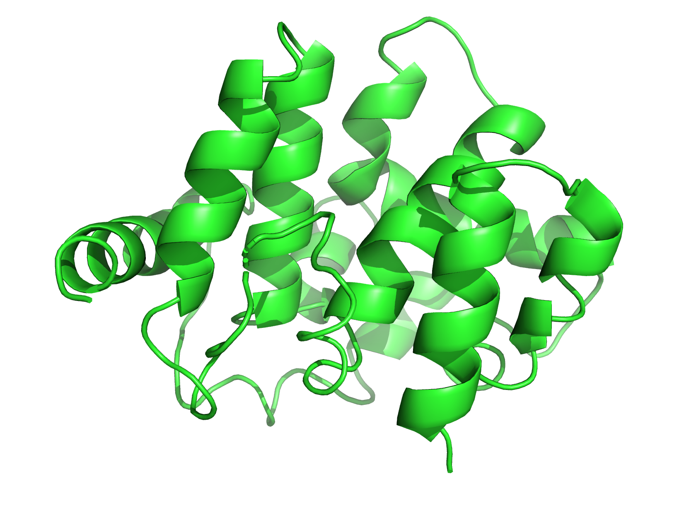

<!-- Improved compatibility of back to top link: See: https://github.com/othneildrew/Best-README-Template/pull/73 -->
<a id="readme-top"></a>
<!--
*** Thanks for checking out the Best-README-Template. If you have a suggestion
*** that would make this better, please fork the repo and create a pull request
*** or simply open an issue with the tag "enhancement".
*** Don't forget to give the project a star!
*** Thanks again! Now go create something AMAZING! :D
-->


<!-- PROJECT SHIELDS -->
<!--
*** I'm using markdown "reference style" links for readability.
*** Reference links are enclosed in brackets [ ] instead of parentheses ( ).
*** See the bottom of this document for the declaration of the reference variables
*** for contributors-url, forks-url, etc. This is an optional, concise syntax you may use.
*** https://www.markdownguide.org/basic-syntax/#reference-style-links
-->

<!-- [![Forks][forks-shield]][forks-url]
[![Stargazers][stars-shield]][stars-url]
[![Issues][issues-shield]][issues-url]
[![MIT License][license-shield]][license-url] -->


<!-- PROJECT LOGO -->
<br />
<div align="center">
  <a href="https://github.com/othneildrew/Best-README-Template">
    
  </a>

  <h3 align="center">FoldGPT: Conditional Protein Structure Generation with GPT model</h3>
</div>


<!-- TABLE OF CONTENTS -->
<details>
  <summary>Table of Contents</summary>
  <ol>
    <li>
      <a href="#about-the-project">About The Project</a>
    </li>
    <li>
      <a href="#getting-started">Getting Started</a>
      <!-- <ul>
        <li><a href="#prerequisites">Prerequisites</a></li>
        <li><a href="#installation">Installation</a></li>
      </ul> -->
    </li>
    <li><a href="#usage">Usage</a></li>
    <li><a href="#downstream-tasks">Downstream Tasks</a></li>
    <li><a href="#dataset">Dataset</a></li>
    <li><a href="#license">License</a></li>
    <li><a href="#contact">Contact</a></li>
    <li><a href="#contact">Citation</a></li>
  </ol>
</details>


<!-- ABOUT THE PROJECT -->
## About The Project
This project aims to generate protein structures using [FoldLanguage](https://github.com/A4Bio/FoldToken_open) via a GPT model. Here's why we introduce FoldGPT:
* <font color="#D79B00">Condition Token</font>: encoding full information (seq, struct, and func) of the known residues.
* <font color="#82B366">Prompt Token</font>: encoding partial information (seq or func) of residues.
* <font color="#808080">Mask Token</font>: used for learning the feature of unkown residues.

Currently, we only encode the structural vq_id as conditional features, while leaving sequence and function conditions as future work to serve as a multimodal generative model.

<p align="right">(<a href="#readme-top">back to top</a>)</p>


## Getting Started
```
conda env create -f environment.yml
```

## Usage

#### Unconditional Structure Generation
```bash
export PYTHONPATH=project_path

CUDA_VISIBLE_DEVICES=0 python sampling.py --save_path results/unconditional --config model_zoom/config.yaml --checkpoint model_zoom/params.ckpt --temperature 2.0 --num_iter 20 --length 150 --nums 20 --mask_mode unconditional
```
One can use this script to generate protein structures from noise. The molel will save **`nums`** generated pdbs in **`save_path`**, the sampling temperature is 2.0, denoising steps are 20, the protein contains 150 residues. 

| Length| Fig1 | Fig2 | Fig3 |
|:-----------------:|:----------------------:|:-------------------:|:-------------------:|
| 50 |  |  |  |
| 100 |  |  |  |
| 200 |  |  |  |
| 300 |  |  |  |


#### Conditional Structure Generation
```bash
CUDA_VISIBLE_DEVICES=0 python sampling.py --save_path results/conditional --config model_zoom/config.yaml --checkpoint model_zoom/params.ckpt --temperature 2.0 --num_iter 20 --nums 20 --mask_mode conditional --template 8vrwB.pdb --mask 39-51,85-98
```
One can use this script to generate protein structures from noise. The molel will save **`nums`** generated pdbs in **`save_path`**, the sampling temperature is 0.5, the protein contains 150 residues. The structure template is **`xxx.pdb`**, where residues in **`39-51`** and **`85-98`** are masked.

| Name| Fig | Comment |
|:-----------------:|:----------------------:|:-------------------:|
| 8vrwB_ref      |          |  reference structure |
| 8vrwB_inpaint1 |          |  inpainting residues from 20 to 30 |
| 8vrwB_inpaint2 |          |  inpainting residues from 60 to 80 |
| 8vrwB_inpaint3 |          |  inpainting residues from 110 to 140 |
| 8vrwB_loop_design |          |  loop design |
| scaffolding1 |          |  scaffolding |
| scaffolding2 |          |  scaffolding |
| scaffolding3 |          |  scaffolding |


<p align="right">(<a href="#readme-top">back to top</a>)</p>


## Dataset & Model

TODO


<!-- * [Malven's Flexbox Cheatsheet](https://flexbox.malven.co/)
* [Malven's Grid Cheatsheet](https://grid.malven.co/)
* [Img Shields](https://shields.io)
* [GitHub Pages](https://pages.github.com)
* [Font Awesome](https://fontawesome.com)
* [React Icons](https://react-icons.github.io/react-icons/search) -->

<!-- #### Structure Generation
##### Unconditional Generation

##### Inpainiting & Scaffolding -->


<!-- This section should list any major frameworks/libraries used to bootstrap your project. Leave any add-ons/plugins for the acknowledgements section. Here are a few examples.

* [![Next][Next.js]][Next-url]
* [![React][React.js]][React-url]
* [![Vue][Vue.js]][Vue-url]
* [![Angular][Angular.io]][Angular-url]
* [![Svelte][Svelte.dev]][Svelte-url]
* [![Laravel][Laravel.com]][Laravel-url]
* [![Bootstrap][Bootstrap.com]][Bootstrap-url]
* [![JQuery][JQuery.com]][JQuery-url] -->


<!-- ## Getting Started

This is an example of how you may give instructions on setting up your project locally.
To get a local copy up and running follow these simple example steps.

### Prerequisites

This is an example of how to list things you need to use the software and how to install them.
* npm
  ```sh
  npm install npm@latest -g
  ``` -->

<!-- ### Installation

_Below is an example of how you can instruct your audience on installing and setting up your app. This template doesn't rely on any external dependencies or services._

1. Get a free API Key at [https://example.com](https://example.com)
2. Clone the repo
   ```sh
   git clone https://github.com/github_username/repo_name.git
   ```
3. Install NPM packages
   ```sh
   npm install
   ```
4. Enter your API in `config.js`
   ```js
   const API_KEY = 'ENTER YOUR API';
   ```
5. Change git remote url to avoid accidental pushes to base project
   ```sh
   git remote set-url origin github_username/repo_name
   git remote -v # confirm the changes
   ```

<p align="right">(<a href="#readme-top">back to top</a>)</p> -->


<!-- USAGE EXAMPLES -->
<!-- ## Usage

Use this space to show useful examples of how a project can be used. Additional screenshots, code examples and demos work well in this space. You may also link to more resources.

_For more examples, please refer to the [Documentation](https://example.com)_

<p align="right">(<a href="#readme-top">back to top</a>)</p> -->


<!-- ROADMAP -->
<!-- ## Roadmap

- [x] Add Changelog
- [x] Add back to top links
- [ ] Add Additional Templates w/ Examples
- [ ] Add "components" document to easily copy & paste sections of the readme
- [ ] Multi-language Support
    - [ ] Chinese
    - [ ] Spanish

See the [open issues](https://github.com/othneildrew/Best-README-Template/issues) for a full list of proposed features (and known issues).

<p align="right">(<a href="#readme-top">back to top</a>)</p> -->


<!-- CONTRIBUTING -->
<!-- ## Contributing

Contributions are what make the open source community such an amazing place to learn, inspire, and create. Any contributions you make are **greatly appreciated**.

If you have a suggestion that would make this better, please fork the repo and create a pull request. You can also simply open an issue with the tag "enhancement".
Don't forget to give the project a star! Thanks again!

1. Fork the Project
2. Create your Feature Branch (`git checkout -b feature/AmazingFeature`)
3. Commit your Changes (`git commit -m 'Add some AmazingFeature'`)
4. Push to the Branch (`git push origin feature/AmazingFeature`)
5. Open a Pull Request

### Top contributors:

<a href="https://github.com/othneildrew/Best-README-Template/graphs/contributors">
  
</a>

<p align="right">(<a href="#readme-top">back to top</a>)</p> -->


<!-- LICENSE -->
## License

Distributed under the [Apache 2.0 license](./LICENSE.txt) License. See `LICENSE.txt` for more information.

<p align="right">(<a href="#readme-top">back to top</a>)</p>


<!-- CONTACT -->
## Contact

Zhangyang Gao  - gaozhangyang@westlake.edu.cn


<p align="right">(<a href="#readme-top">back to top</a>)</p>


<!-- ACKNOWLEDGMENTS -->
<!-- ## Acknowledgments

Use this space to list resources you find helpful and would like to give credit to. I've included a few of my favorites to kick things off!

* [Choose an Open Source License](https://choosealicense.com)
* [GitHub Emoji Cheat Sheet](https://www.webpagefx.com/tools/emoji-cheat-sheet)
* [Malven's Flexbox Cheatsheet](https://flexbox.malven.co/)
* [Malven's Grid Cheatsheet](https://grid.malven.co/)
* [Img Shields](https://shields.io)
* [GitHub Pages](https://pages.github.com)
* [Font Awesome](https://fontawesome.com)
* [React Icons](https://react-icons.github.io/react-icons/search)

<p align="right">(<a href="#readme-top">back to top</a>)</p> -->


<!-- MARKDOWN LINKS & IMAGES -->
<!-- https://www.markdownguide.org/basic-syntax/#reference-style-links -->
[contributors-shield]: https://img.shields.io/github/contributors/othneildrew/Best-README-Template.svg?style=for-the-badge
[contributors-url]: https://github.com/othneildrew/Best-README-Template/graphs/contributors
[forks-shield]: https://img.shields.io/github/forks/othneildrew/Best-README-Template.svg?style=for-the-badge
[forks-url]: https://github.com/othneildrew/Best-README-Template/network/members
[stars-shield]: https://img.shields.io/github/stars/othneildrew/Best-README-Template.svg?style=for-the-badge
[stars-url]: https://github.com/othneildrew/Best-README-Template/stargazers
[issues-shield]: https://img.shields.io/github/issues/othneildrew/Best-README-Template.svg?style=for-the-badge
[issues-url]: https://github.com/othneildrew/Best-README-Template/issues
[license-shield]: https://img.shields.io/github/license/othneildrew/Best-README-Template.svg?style=for-the-badge
[license-url]: https://github.com/othneildrew/Best-README-Template/blob/master/LICENSE.txt
[linkedin-shield]: https://img.shields.io/badge/-LinkedIn-black.svg?style=for-the-badge&logo=linkedin&colorB=555
[linkedin-url]: https://linkedin.com/in/othneildrew
[product-screenshot]: foldtoken/images/screenshot.png
[Next.js]: https://img.shields.io/badge/next.js-000000?style=for-the-badge&logo=nextdotjs&logoColor=white
[Next-url]: https://nextjs.org/
[React.js]: https://img.shields.io/badge/React-20232A?style=for-the-badge&logo=react&logoColor=61DAFB
[React-url]: https://reactjs.org/
[Vue.js]: https://img.shields.io/badge/Vue.js-35495E?style=for-the-badge&logo=vuedotjs&logoColor=4FC08D
[Vue-url]: https://vuejs.org/
[Angular.io]: https://img.shields.io/badge/Angular-DD0031?style=for-the-badge&logo=angular&logoColor=white
[Angular-url]: https://angular.io/
[Svelte.dev]: https://img.shields.io/badge/Svelte-4A4A55?style=for-the-badge&logo=svelte&logoColor=FF3E00
[Svelte-url]: https://svelte.dev/
[Laravel.com]: https://img.shields.io/badge/Laravel-FF2D20?style=for-the-badge&logo=laravel&logoColor=white
[Laravel-url]: https://laravel.com
[Bootstrap.com]: https://img.shields.io/badge/Bootstrap-563D7C?style=for-the-badge&logo=bootstrap&logoColor=white
[Bootstrap-url]: https://getbootstrap.com
[JQuery.com]: https://img.shields.io/badge/jQuery-0769AD?style=for-the-badge&logo=jquery&logoColor=white
[JQuery-url]: https://jquery.com 